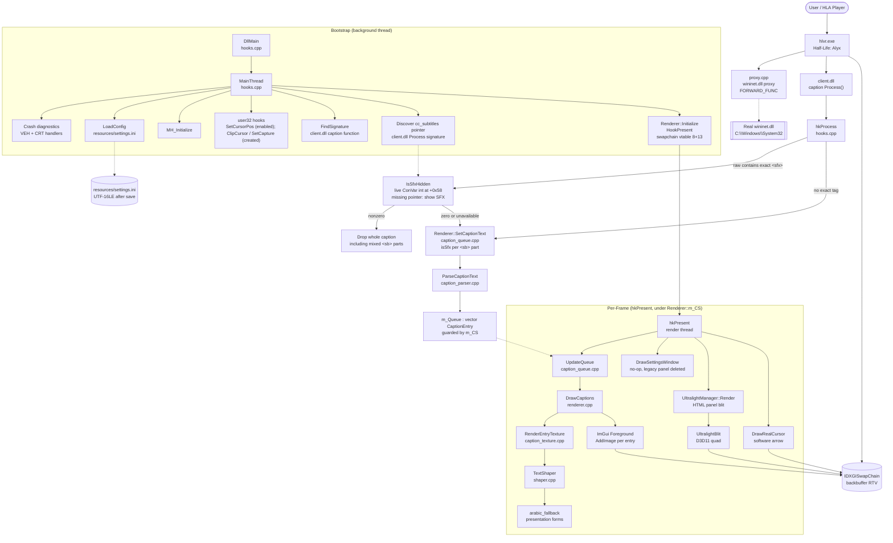

# Architecture

> Source root: `C:\path\to\Hlyx_Caption` · `HlyxCaption/HlyxCaption.vcxproj` → `wininet.dll` · x64 only

## Overview

Hlyx Caption is a **proxy DLL + hook patch** that cohabits the Half-Life: Alyx process. At load time it forwards WinINet to the real system DLL so the game is unaffected, then on a background thread it locates the game's caption delivery function by byte signature, hooks `IDXGISwapChain::Present`, and on every presented frame renders its own caption overlay (shaped by HarfBuzz/FriBidi/FreeType) and an HTML settings panel (Ultralight) on the desktop backbuffer.

State lives in three places: (1) `OverlayConfig g_Config` (global struct, file `resources/settings.ini`), (2) `Renderer::m_Queue` — a `vector<CaptionEntry>` of active phrases each carrying the `rendered*` snapshot of the config that shaped it plus its own `ID3D11Texture2D`/`SRV`/`texID`, guarded by `Renderer::m_CS`, and (3) the Ultralight `View` bitmap (CPU) → D3D11 texture handled by `UltralightManager`.

## Components

- **Proxy layer** — `HlyxCaption/proxy.cpp`: `FORWARD_FUNC` macros lazily load the real `wininet.dll` and tail-call each export. See [modules/core-bootstrap.md](modules/core-bootstrap.md).
- **Bootstrap & hooks** — `HlyxCaption/hooks.cpp`: `DllMain`/`MainThread`, crash handlers, DPI, sig-scan, `hkProcess`. See [modules/core-bootstrap.md](modules/core-bootstrap.md).
- **Renderer** — `HlyxCaption/renderer.cpp` + `renderer.h`: `HookPresent`, `InitImGui`, `WndProc`, `DrawCaptions`, `UpdateQueue`, `RenderEntryTexture`, and software cursor. See [modules/caption-pipeline.md](modules/caption-pipeline.md).
- **Caption parsing/queue/texture** — `caption_parser.cpp`, `caption_queue.cpp`, `caption_texture.cpp`: Valve tag grammar, entry lifecycle, word-wrap+shape+composite. See [modules/caption-pipeline.md](modules/caption-pipeline.md).
- **Text shaping** — `shaper.cpp` + `arabic_fallback.cpp`: `TextShaper` FSM (FreeType+HarfBuzz+FriBidi) + presentation-forms repair table (`arabic_fallback_data.h`, 731 entries). See [modules/text-shaping.md](modules/text-shaping.md).
- **Config** — `config.h` + `config_parse.cpp`: `OverlayConfig`, `ReadFileToUtf8`/`ParseConfigText`, `SaveConfig`. See [modules/configuration.md](modules/configuration.md).
- **Ultralight settings panel** — `ui_ultralight/UltralightManager.cpp`, `UltralightBlit.cpp`, `UltralightPlatform.cpp`, `embedded_ui.h`, HTML/CSS/JS assets: offscreen bitmap → D3D11 blit, JS↔C++ polling bridge. See [modules/ui-ultralight.md](modules/ui-ultralight.md).
- **Legacy ImGui kit (deleted)** — `ui_widgets.*`, `ui_theme.h`, `lang/` were removed (zero live callers); the live panel is Ultralight-only (see [modules/ui-ultralight.md](modules/ui-ultralight.md)).
- **Hook engine** — `minhook-detours-src/`: MinHook MH_* API reimplemented over SlimDetours + PHNT native headers. See [modules/hooking.md](modules/hooking.md).
- **Vendor runtimes** — `vendor/Ultralight/{include,lib}`, `imgui/`: linked statically or redistributed from `dist/`. See [modules/hooking.md](modules/hooking.md) and [modules/ui-ultralight.md](modules/ui-ultralight.md).

## System Diagram

## Data Flow

1. **Boot & hook install** — `hooks.cpp:DllMain` → `MainThread` → `MH_Initialize` → create/enable `SetCursorPos` hook (the `ClipCursor`/`SetCapture` hooks are created but not explicitly enabled in the current bootstrap order) → sig-scan `client.dll` for the caption function (`F3 0F 11 5C 24 ?` …) and the `cc_subtitles` ConVar pointer via `Process` → `MH_CreateHook(oProcess)` → `renderer.cpp:HookPresent` (temp window+device vtable patch for `Present`[8]/`Resize`[13]). ConVar lookup failure leaves SFX visible; it does not block the caption hook.
2. **First Present → ImGui + Ultralight init** — `renderer.cpp:InitImGui`: ImGui context, `ImGui_ImplWin32/DX11_Init`, backbuffer RTV, WndProc subclass, 1×1 blank cursor, `UltralightManager::Initialize`, and Raw Input registration.
3. **Caption arrives** — game `Process(this, raw, duration, …)` → `hooks.cpp:hkProcess`: if raw contains exact `<sfx>`, read the live `cc_subtitles` integer at `+0x58`; when nonzero, drop the **entire** raw caption before `SetCaptionText` (even mixed `<sb>` captions). Otherwise `caption_queue.cpp:SetCaptionText` under `m_CS` splits on `<sb>`, flags `isSfx` per part, parses formatting (the parser silently strips `<sfx>` as an unknown tag), splits duration ∝ visible chars, and pushes `CaptionEntry`. The `rendered*` config snapshot is filled when the entry's texture is built (`RenderEntryTexture`/`UpdateQueue`), not stored at push time.
4. **Per-frame update** — `caption_queue.cpp:UpdateQueue`: expire by QPC, show SFX immediately after its scheduled start without fade-in but use normal fade-out, rebuild and reshape textures when active-phrase signature or config snapshot changes (50 ms throttle for spacing-only), stack `targetY` from `pos_y·H`, ease `visualY` @ 8.0, font-path drift → `ReloadFontPreserveQueue`. F11 independently hides all captions.
5. **Per-entry texture** — `caption_texture.cpp:RenderEntryTexture`: collect active phrases → greedy word-wrap on ASCII space by measured width → `TextShaper::ShapeLine` per line → composite RGBA buffer (+8 px margin) → upload `ID3D11Texture2D`+SRV. No CPU copy is kept.
6. **Shaping** — `shaper.cpp:Shape/ShapeLine`: `arabic_fallback::NormalizeForFace` → `SplitDirectionalRuns` (FriBidi bidi types → visual LTR) → `BuildFontSpans` (per-char cmap coverage) → HarfBuzz over whole re-encoded view string → `FT_Load_Glyph(FT_LOAD_RENDER)` 26.6→px → bbox-normalized `GlyphBitmap`s.
7. **Desktop compositing** — `renderer.cpp:DrawCaptions`: foreground draw-list `AddImage` per entry (outline ring + shadow offsets + `DrawBackgroundBox` when enabled), settings-open edge → `OnPanelOpened`, `DrawSettingsWindow` is an empty no-op (the legacy panel was deleted and only a comment remains), `ImGui::Render`, `UltralightManager::Render` (bitmap→D3D11 quad via `UltralightBlit`), `DrawRealCursor` (user32 arrow extracted via `GetIconInfo`/`GetDIBits`).
8. **Settings input/output** — Ultralight messages queued by WndProc (`ProcessWin32Message` → `m_EventQueue`) are drained inside `UltralightManager::Render` on the render thread; JS→C++ via `window.__saveRequested/__resetRequested/__stateDirty/__preview*` flags polled and applied through `ApplyConfigField*` → `SaveConfig(g_IniPath)`; C++→JS via `EvaluateScript("window.hlaConfig._setValue[…]")` on `OnDOMReady`/reset/open.
> Live JS edits update `g_Config`; only the explicit `__saveRequested` flag writes them to disk.
9. **Config persistence** — `config_parse.cpp:ReadFileToUtf8` handles UTF-8/UTF-16LE/BE BOM → UTF-8; `ParseConfigText` applies `;`/`#` comments, last-key-wins, `{ModDir}` expansion; `SaveConfig` in `hooks.cpp` writes via `WritePrivateProfileStringW` (fresh files become UTF-16LE).

## Key Design Decisions

- **Single `CRITICAL_SECTION m_CS`** for `m_Queue` + `TextShaper` ownership — deliberately coarse to avoid shape-while-mutating races; the cost is caption-thread work (parse+shape+upload) stalling the render thread under the same lock.
- **No atlas, one texture per entry** — simplifies lifetime (one SRV per `CaptionEntry`, rebuilt on change) at the cost of one GPU allocation per active caption.
- **Presentation-forms repair is opt-in per face** — `arabic_fallback::NormalizeForFace` only rewrites codepoints the face actually lacks, checked against its cmap; otherwise text passes through unchanged.
- **Embedded page plus disk-backed assets** — the main page comes from `kEmbeddedHTML`, while `UltralightPlatform` still resolves `file://` requests from the on-disk asset/resources fallbacks.
- **`g_ModDirA` + `g_IniPath` fixed at boot** — font and INI resolution never consults the working directory, only the DLL's directory.
