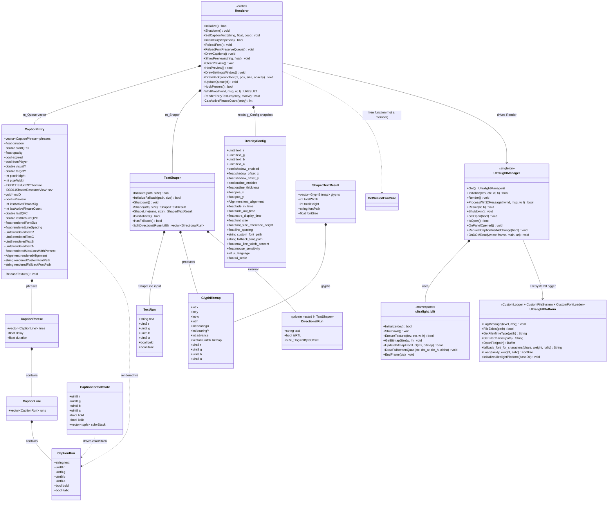

# Class Diagram

> Core types in `HlyxCaption/` — fields trimmed to the load-bearing subset. Generics use `~T~` per Mermaid.

## Notes

- `Renderer` is **static-everything** — no instances; `m_CS` (`CRITICAL_SECTION`) guards `m_Queue` and the `TextShaper` it owns. `UltralightManager` is a Meyers singleton with its own `mutex` + `deque<PendingEvent>` so the `View` is single-threaded to the render thread.
- Caption layering: `CaptionPhrase{lines{runs{text,rgba,bold,italic}}}` — `CaptionFormatState` is the transient parser stack that builds `CaptionRun`s; `caption_texture` rebuilds `TextRun` vectors from those runs for `ShapeLine`. `CaptionEntry` additionally stores a full `OverlayConfig` snapshot (`rendered*`) plus `lastActivePhraseSig`/`lastQPC` to detect when a texture needs rebuilding.
- `TextShaper` exposes only `Shape`/`ShapeLine` (FriBidi→HarfBuzz→FreeType → `ShapedTextResult`); `DirectionalRun` is a private nested struct, and `BuildFontSpans` is a static free function in `shaper.cpp`, not a member. `GetScaledFontSize` is likewise a free function in `renderer.h`, not a `Renderer` member.
- Vendored `imgui` and `minhook-detours-src` types are omitted — they appear only as `ImDrawList`/`ImGuiContext` consumers and `MH_*` trampoline storage.
