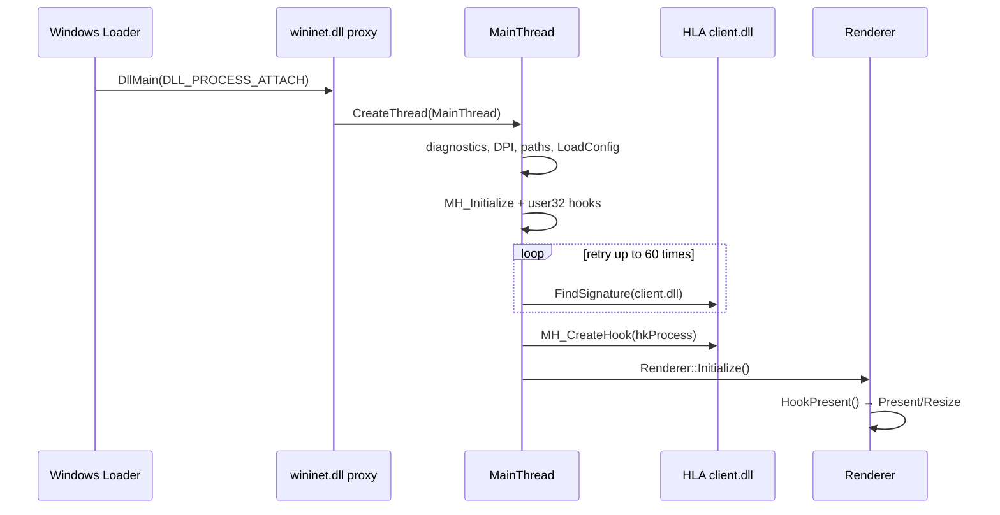
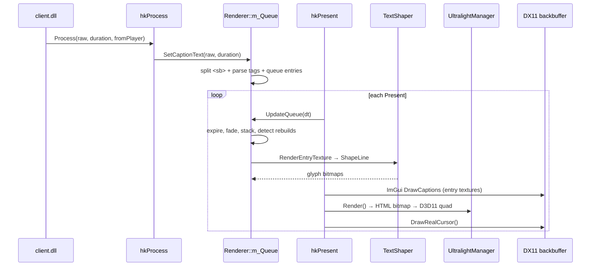
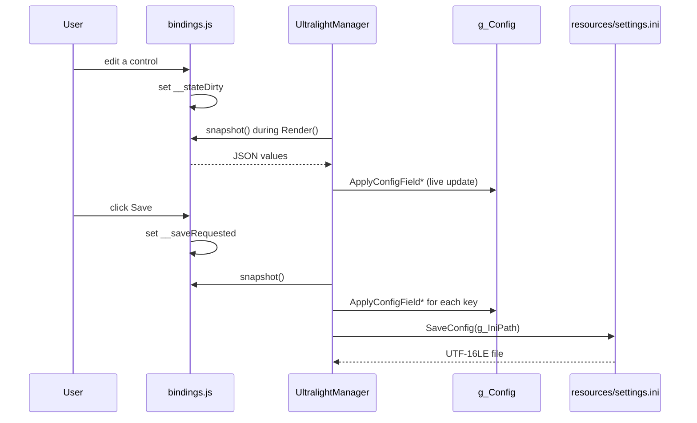

# Sequence Diagrams

## 1. Bootstrap and Hook Installation

## 2. Caption Delivery and Rendering

## 3. Settings Save (HTML Panel → INI)

### Notes

- `Renderer::m_CS` guards caption queue and shaping state.
- `UltralightManager::ProcessWin32Message` only queues input; the `View` is touched on the render thread.
- `ReadFileToUtf8` accepts UTF-8 and UTF-16 BOMs, so saved settings load consistently.
