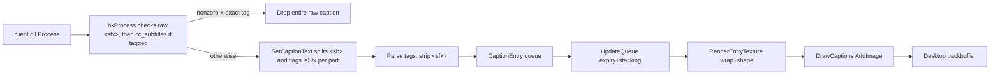

# Features

What Hlyx Caption ships

> One `wininet.dll` next to `hlvr.exe` replaces the built-in subtitles with a fully themeable, Arabic-correct desktop overlay.

  
<h4>◈ Arabic-Correct Captions</h4>
FriBidi bidi → HarfBuzz shaping → FreeType raster per-entry. Ligatures, joining, mixed RTL/LTR on one line.

  
<h4>◈ Per-Entry Textures</h4>
Word-wrap → composite RGBA → <code>DXGI_FORMAT_R8G8B8A8_UNORM_SRGB</code> upload. Outline ring, shadow, background box, stacked animation. SFX appears without fade-in.

  
<h4>◈ HTML Settings Panel</h4>
F10. Ultralight offscreen <code>View → Bitmap → D3D11 quad</code>. Live edits, Save/Reset/Preview.

## At a Glance

| Capability | Where | Notes |
|---|---|---|
| Subtitle interception | `hooks.cpp:hkProcess` | Sig-scan `client.dll`; check live `cc_subtitles` and drop the whole raw caption if hidden and it contains exact `<sfx>`, before `SetCaptionText` |
| Tag grammar | `caption_parser.cpp` | `<clr>`, `<playerclr>`, `<I>/<B>`, `<cr>`, `<delay>`, `<sb>` |
| SFX timing | `caption_queue.cpp` | Per-`<sb>`-part `isSfx` flag; instant appearance after scheduled start, normal fade-out. Parser silently strips `<sfx>` as an unknown tag |
| Shaping | `shaper.cpp` + `arabic_fallback.cpp` | 731-entry presentation-forms table |
| Font switching | `renderer.cpp:ReloadFontPreserveQueue` | Detects INI drift, preserves queue |
| Desktop compositing | `renderer.cpp:hkPresent` | `UpdateQueue → DrawCaptions → Ultralight → Cursor` |

## Caption Pipeline (summary)

See [Architecture](architecture.md) and [Caption Pipeline](modules/caption-pipeline.md) for the full flow.

SFX follows the game's `cc_subtitles` value at runtime (read from its ConVar integer at `+0x58`); if lookup fails, SFX remains visible. There is no separate mod INI or panel setting. F11 hides **all** captions independently.

## Settings Panel (F10)

- 8 tabs: **Text / Color / Border / Shadow / Position / Timing / Reading / General**. The current General tab exposes `ui_language` only.
- The exposed controls map to the supported live INI fields (`font_size`, `text_r`, `outline_thickness`, `pos_x`, …); several compatibility fields remain file-only.
- Footer: معاينة (preview) / حفظ (save) / استعادة الافتراضي (reset) / إغلاق (close)
- Bridge: `window.hlaConfig._setValue[key](v)` + `snapshot()` JSON + flags `__saveRequested/__stateDirty/__preview*` — see [Ultralight](modules/ui-ultralight.md).

## Visual Polish

- **Typography:** `font_size` scaled by `screenH / font_size_reference_height` (1080p baseline), `line_spacing`, `max_line_width_percent`.
- **Effects:** Outline (tinted ring), Shadow (offset copies), Background box (rounded, alpha), cursor isolation via the currently enabled `SetCursorPos` hook plus a software cursor (`GetIconInfo` → D3D11 texture). `ClipCursor` and `SetCapture` hooks are created but are not explicitly enabled in the current bootstrap order.
- **Welcome banner:** `banner_config.h` (`kLogoMaxPx`, `kFadeIn/Hold/FadeOutSec`) scaled by `viewportH/1080`.

## Platform Support

- **OS:** Windows 10/11 x64 only (proxy DLL, DXGI/D3D11)
- **Languages:** Arabic default (`2` in `config.h`) and English (`1`). The HTML panel switches its strings and direction at runtime. Caption shaping is optimized for Arabic/Latin; arbitrary RTL scripts are not guaranteed — see [Language Support](language-support.md).
