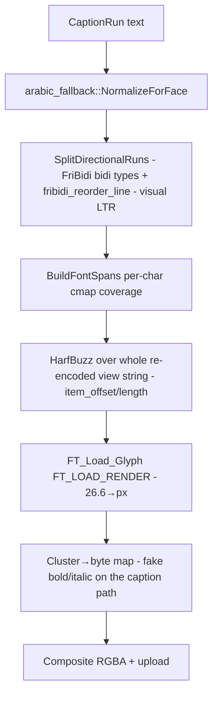

# Language Support & Text Shaping

<p class="kicker">FreeType + HarfBuzz (<code>hb-ft</code>) + FriBidi — per-entry, config-snapshot-aware</p>

## Pipeline



1. **Presentation-forms repair** (`arabic_fallback`) checks `FT_Get_Char_Index` per codepoint; for each missing `U+FB50–FEFC` tries: base `0600–06FF`, sibling contextual form (lazy `SiblingMap` from `arabic_fallback_data.h`), or decomposition (lam-alef, tatweel+mark). Strips leading `U+0020` on isolated marks, depth ≤4. Table `kFormEntries` is **GENERATED** (731 entries from `UnicodeData.txt` via `gen_arabic_data.ps1` — not in repo).
2. **Bidi:** `SplitDirectionalRuns` → `fribidi_get_bidi_types` + `FRIBIDI_PAR_ON` → parity grouping → `fribidi_reorder_line` → `vector<DirectionalRun{isRTL, logicalByteOffset}>` in visual LTR.
3. **Spans:** `BuildFontSpans` — per-char `FT_Get_Char_Index`; fallback span only if fallback **fully** covers the missing run; maximal same-font spans.
4. **Shape:** HarfBuzz over the whole re-encoded view with `item_offset/length` so joining crosses spans; RTL spans visited reversed; `direction/script` **hard-coded** (`RTL→HB_SCRIPT_ARABIC/"ar"`, `LTR→HB_SCRIPT_LATIN/"en"`).
5. **Raster:** fake bold/italic (`FT_GlyphSlot_Embolden` / `Oblique`, bbox normalize) applies on the caption path — `ShapeLine` renders with `FT_LOAD_DEFAULT`, then applies `Oblique` + `Embolden` + `FT_Render_Glyph`. Plain `Shape` instead uses `FT_LOAD_RENDER|FT_LOAD_TARGET_NORMAL` with neither, so callers of `Shape` get no emboldening.

## API Surface (`shaper.h`)

```cpp
TextShaper::Initialize(path,size) / InitializeFallback(path,size) / Shutdown
Shape(utf8,size) → ShapedTextResult{glyphs,totalWidth/Height}
ShapeLine(vector<TextRun>,size) → ShapedTextResult  // captions
```

- **No internal mutex** — `TextShaper` relies on `Renderer::m_CS`.

## Fonts

- **Resolution:** absolute path as-is; bare name → `{ModDir}\resources\<name>`; if no bundled font can be loaded, the native fallback checks Windows `tahoma.ttf`, `segoeui.ttf`, and `seguihis.ttf`.
- **Current defaults:** `custom_font_path = Cairo-Regular.ttf`, `fallback_font_path = Cairo-Regular.ttf` (dist provides `Cairo-Regular.ttf`).
- **User fonts:** drop any `*.ttf|otf|ttc|otc|woff|woff2` into `{ModDir}\resources\` — enumerated into the HTML `.fdrop` dropdowns via `hlaFonts.setList`.

## RTL Gotchas & Limitations

- Script hard-coding: other RTL scripts (Hebrew, etc.) will mis-shape — needs per-run `hb_script_t` from FriBidi data.
- Word-wrap splits on ASCII space only — no NBSP/tab handling.
